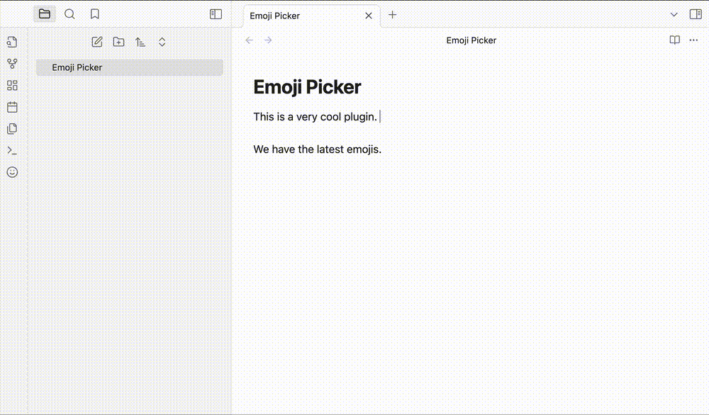

# Emoji Picker plugin for Obsidian

This plugin adds a button to the editor toolbar that opens a modal with a searchable emoji picker. Clicking an emoji inserts it at the cursor position in the editor.

You can also set a hotkey to open the emoji picker.
The recommended hotkey is `Ctrl+.`, but you can set it to any key combination you like.

## Why use this plugin?

Unlike other plugin this plugin is using the latest versions of the emoji and also have the search functionality alogn **skin tone** and category selection which lacks in other plugins.

## Emoji Version

As of November 2024, we are using the emoji-mart library so the emoji version is [15](https://emojipedia.org/emoji-15.0/).

## Installation

### From within Obsidian

- Open Settings > Community plugins > Browse
- Search for "Emoji Picker"
- Click "Install"
- Go to "Installed plugins" and enable the plugin
- Set a hotkey for the plugin in the settings; the command to set is `Emoji Picker: Select and Insert Emoji`

### Manual installation

- Download the latest release from the [releases page](https://github.com/alifa98/obsidian-emoji-picker/releases). (You can download the zip file from the latest release it includes the three files needed for the plugin or you can simply download the `main.js`, `styles.css`, and `manifest.json` files from releases)
- When you got the files, create a folder in your vault's `.obsidian/plugins/` directory named `emoji-picker`.
- Put `main.js`, `styles.css`, and `manifest.json` in the created folder, such as `VaultFolder/.obsidian/plugins/emoji-picker/`.
- Reload Obsidian.
- Enable the plugin in the settings.
- Set a hotkey for the plugin in the settings; the command to set is `Emoji Picker: Select and Insert Emoji`
